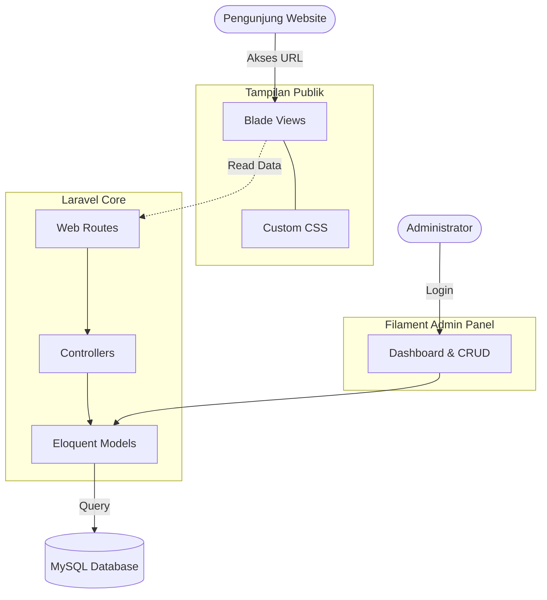

# SDN Pendrikan Lor 02 - Website & Admin Panel

Sistem informasi dan company profile untuk SDN Pendrikan Lor 02 Semarang. Dibangun menggunakan teknologi web modern dengan fokus pada performa, estetika (*UI/UX*), dan kemudahan pengelolaan konten secara dinamis melalui Admin Panel.

## 🏗 Arsitektur Sistem

Proyek ini dibangun di atas tumpukan teknologi (Tech Stack) berikut:
- **Framework Utama:** Laravel 11 (PHP 8.2+)
- **Admin Panel:** Filament PHP v3
- **Database:** MySQL
- **Frontend Styling:** Vanilla CSS (CSS Variables) dengan pola desain komponen modern.

### Flow Chart Arsitektur



## 🚀 Tutorial Menjalankan Program (Local Development)

Ikuti langkah-langkah di bawah ini untuk menjalankan website dan admin panel di komputer lokal (localhost).

### Persyaratan
- PHP versi 8.2 atau lebih baru.
- Composer.
- MySQL / MariaDB.

### Langkah-langkah Instalasi

1. **Clone Repositori**
   Unduh kode sumber ke dalam komputer Anda.
   ```bash
   git clone https://github.com/imdevedugame/sd2pendrikankidul.git
   cd sd2pendrikankidul
   ```

2. **Install Dependensi Composer**
   ```bash
   composer install
   ```

3. **Konfigurasi Environment**
   Gandakan file `.env.example` menjadi `.env`.
   ```bash
   cp .env.example .env
   ```
   Buka file `.env` dan sesuaikan pengaturan database Anda:
   ```env
   DB_CONNECTION=mysql
   DB_HOST=127.0.0.1
   DB_PORT=3306
   DB_DATABASE=sd2pendrikankidul
   DB_USERNAME=root
   DB_PASSWORD=
   ```

4. **Generate Application Key**
   ```bash
   php artisan key:generate
   ```

5. **Migrasi Database dan Seeding**
   Buat database kosong bernama `sd2pendrikankidul` di MySQL (lewat phpMyAdmin atau terminal). Lalu jalankan perintah ini untuk membangun tabel sekaligus mengisi data awal (Profil Sekolah, Berita, Guru, dll):
   ```bash
   php artisan migrate:fresh --seed
   ```

6. **Tautkan Folder Storage**
   Agar gambar-gambar yang di-*upload* melalui admin panel bisa diakses publik:
   ```bash
   php artisan storage:link
   ```

7. **Jalankan Server Lokal**
   ```bash
   php artisan serve
   ```
   Akses website di: `http://localhost:8000`

---

## 🔐 Akses Admin Panel

Untuk mengelola konten (Ubah profil sekolah, tambah berita, foto guru, link lomba, dll), masuk ke halaman Admin Panel:

- **URL:** `http://localhost:8000/admin`
- **Email:** `admin@sdnpendrikanlor02.id`
- **Password:** `password`

Anda bisa merubah password ini atau menambah pengguna lain dari menu **Users** di dalam Admin Panel.
